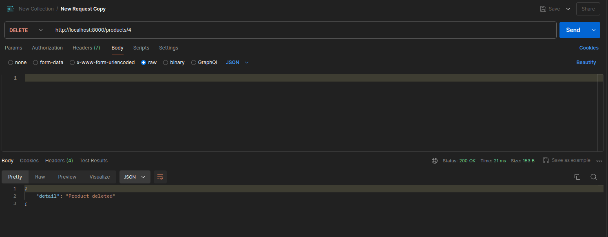

# Микросервисное веб приложение для мониторинга товаров на сайте
## Stack 
- FastAPI
- Docker-compose
- PostgreSQL
- SQLAlchemy + Alembic
- Телеграм бот(Aiogram)


## Функционал:

1. Модуль HTTP API  С использованием библиотеки FastApi.
Содержит следующие маршруты:
- Добавление нового товара на мониторинг (ссылка на товар)
- Удаление товара
- Получение списка товаров на мониторинге
- Получение истории цен на товар.
2. Телеграм бот с аналогичным функционалом
3. Модуль мониторинга, который периодически получает новую цену товара:  
При добавлении товара, получаем только его название, описание и рейтинг (если есть).  
Автоматическая запись цены на товар раз в час.
4. БД для хранения информации (PostgreSQL)  
Запуск кода через docker-compose, каждый модуль в отдельном контейнере.  
 Модуль БД имеет volume для сохранения информации в нем.  
Для работы с базой используется SQLAlchemy + Alembic.  

Для примера используется сайт sunlight - парсер настроен на него. Достаточно взять полную ссылку на товар. Пример:
`https://sunlight.net/catalog/ring_130995.html`

## Как развернуть проект:
### 1 Клонируем проект

```bash
git clone https://github.com/Yomorad/fastapi-monitoring.git
```

### 2 Прописываем свои конфиги в .env
```bash
TELEGRAM_BOT_TOKEN='your_bot_token' # Поставь новый токен от BotFather из телеги
```

### 3 Поднимаем контейнеры
```bash
docker compose up --build
# Completed!
# в конце работы выключаем контейнеры и удаляем привязанные тома
docker compose down -v
```

## Тестируем проект:

### Postman:
#### 1 GET http://0.0.0.0:8000/products/

#### 2 DELETE http://0.0.0.0:8000/products/<<id>>

#### 3 POST http://0.0.0.0:8000/products/ 
    body:{"link_product": "https://sunlight.net/catalog/ring_146397.html"}

#### 4 GET http://0.0.0.0:8000/products/<<id>>/price-history


### Телеграм-бот:
#### /start


#### /add


#### /list


#### /delete


#### /history


